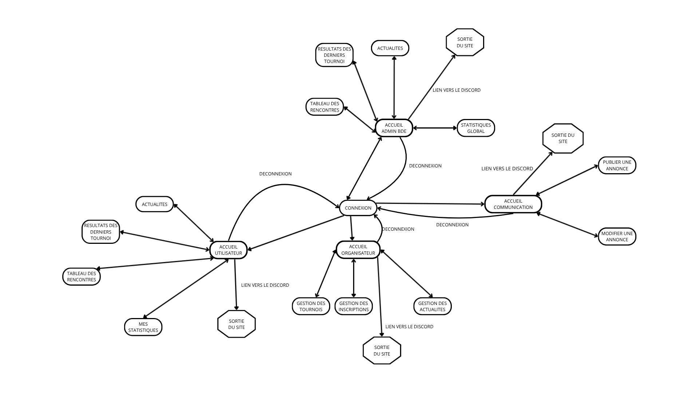

# SQLeague
Projet de **plateforme de gestion de tournois étudiants** dans le cadre du cours **Conception**

## SiteMap de l'application

## Auteurs

- [Octave](https://github.com/O-glt)
- [Axel](https://github.com/Axel-Cfr)
- [Alix](https://github.com/xeliane)

## Liens

- [GitHub](https://github.com/Axel-Cfr/SQLeague)
- [Trello](https://trello.com/b/RIIfY1o3/sqleague)
- [Documentation Technique](docs/Doc_technique.md)
- [Vidéo de présentation](https://drive.proton.me/urls/Q50GQ5X4Y4#NkvhmXsKbWBs)
- [Vidéo technique](lien à mettre ici)

## Licence

JavaPass est sous licence [CC-BY-SA-4.0](LICENSE)
