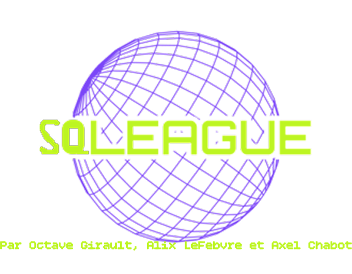

# SQLeague

## Description

SQLeague est un projet de conception d'une **plateforme de gestion de tournois étudiants**.  
Ce projet a été réalisé dans le cadre du cours **ConceptionBDD** en première année du cycle préparatoire intégré de 3iL.

## Auteurs

- [Octave](https://github.com/O-glt)
- [Axel](https://github.com/Axel-Cfr)
- [Alix](https://github.com/xeliane)

## Liens

- [GitHub](https://github.com/Axel-Cfr/SQLeague)
- [Trello](https://trello.com/b/RIIfY1o3/sqleague)
- [Dossier du projet](dossier/ConceptionBDD.pdf) (Attention, cliquer sur afficher plus de page pour voir l'integralité du pdf)
- [Vidéo de présentation](https://drive.proton.me/urls/Q50GQ5X4Y4#NkvhmXsKbWBs) (Disponible jusqu'au 30 juillet 2026)
- [Vidéo technique](https://drive.google.com/file/d/1_Th21uMAOWLb6_ag-SzH0rjJGNad-5mc/view?usp=sharing)

## Licence

SQLeague est sous licence [CC-BY-SA-4.0](LICENSE)
